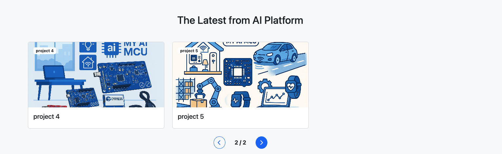

# PKGalleryCards

`PKGalleryCards` is a responsive card carousel component built with Bootstrap 5 and jQuery. It displays image cards with titles, clickable links, and an optional full-image display mode. Ideal for portfolios, product showcases, and featured projects.

## 📦 Features

- Displays 3 cards per carousel page (customizable if needed)
- Supports clickable images with a `url` link
- Supports full-size image display using `displayFullImage: true`
- Auto-generated page indicator (e.g., `1 / 2`)
- Can be embedded into any HTML container via a selector

---

## 📁 File Structure

```

/your-project
│
├── index.html              # Example usage
├── PKGalleryCards.js       # JavaScript class
├── PKGalleryCards.css      # Stylesheet
└── assets/images/\*.png     # Image assets

````

---

## 🚀 Quick Start

### 1. Include Dependencies in `index.html`

```html
<!-- Bootstrap 5 & FontAwesome -->
<link href="https://cdn.jsdelivr.net/npm/bootstrap@5.3.3/dist/css/bootstrap.min.css" rel="stylesheet">
<link href="https://cdnjs.cloudflare.com/ajax/libs/font-awesome/6.5.0/css/all.min.css" rel="stylesheet">

<!-- Custom Styles -->
<link href="PKGalleryCards.css" rel="stylesheet">
````

```html
<!-- jQuery + Bootstrap 5 JS -->
<script src="https://code.jquery.com/jquery-3.7.1.min.js"></script>
<script src="https://cdn.jsdelivr.net/npm/bootstrap@5.3.3/dist/js/bootstrap.bundle.min.js"></script>

<!-- Custom Component -->
<script src="PKGalleryCards.js"></script>
```

---

### 2. Add the Container

```html
<div id="pk-gallery-cards"></div>
```

---

### 3. Initialize the Component

```javascript
const gallery = new PKGalleryCards({
  selector: '#pk-gallery-cards',
  title: 'Latest Projects',
  items: [
    {
      title: 'Project 1',
      img: 'assets/images/1.png',
      url: 'https://www.example.com'
    },
    {
      title: 'Project 2',
      img: 'assets/images/2.png',
      displayFullImage: true
    },
    {
      title: 'Project 3',
      img: 'assets/images/3.png'
    }
  ]
});
```

---

## 🧾 Configuration Options

| Option     | Type     | Description                                  |
| ---------- | -------- | -------------------------------------------- |
| `selector` | `string` | CSS selector where the component will render |
| `title`    | `string` | Section title shown above the carousel       |
| `items`    | `array`  | List of card items (see format below)        |

#### Single `item` format:

```javascript
{
  title: 'Project Title',             // Required: Card title
  img: 'assets/images/sample.png',    // Required: Image path
  url: 'https://example.com',         // Optional: Clickable link
  displayFullImage: true              // Optional: Show image in full size
}
```

---

## 🎨 Styling

Customize the image display in `PKGalleryCards.css`:

* `.cover-image` → default: cropped and fills height
* `.full-image` → displays original image proportions (not cropped)

---

## 🧩 Dependencies

* [Bootstrap 5](https://getbootstrap.com/)
* [jQuery 3.x](https://jquery.com/)
* [Font Awesome](https://fontawesome.com/)

---

## 📄 License

MIT License.


---

## 📄 Example

See `index.html` for a working demo, or contact the author for further integration help.

---

## 🖼️ Screenshot




---

## 📝 License & Author

* Author: PK
* License: MIT
 
## 💡 Support This Project

If you find this project helpful, please consider supporting the author **Powen Ko**.  
Your donation helps maintain and improve open-source software, create high-quality tutorials, and contribute to the developer community.

[](https://www.paypal.com/ncp/payment/4W7NYVPYLUHBQ)


---

# PKGalleryCards

`PKGalleryCards` 是一個使用 Bootstrap 5、jQuery 建構的響應式卡片輪播組件，可顯示圖片、標題、連結與原圖模式，適合作品展示、產品導覽等用途。

## 📦 功能特色

- 每頁固定顯示 3 張卡片（可自訂）
- 支援圖片點擊跳轉 `url`
- 支援原圖顯示模式 `displayFullImage`
- 自動計算頁數，並顯示頁碼（如：`1 / 2`）
- 可靈活嵌入至任意 HTML 元素中

---

## 📁 檔案結構

```

/your-project
│
├── index.html              # 範例使用頁面
├── PKGalleryCards.js       # 核心 JavaScript 類別
├── PKGalleryCards.css      # 樣式表
└── assets/images/\*.png     # 圖片素材

````

---

## 🚀 快速使用

### 1. 引入必要資源於 `index.html`

```html
<!-- Bootstrap 5 & FontAwesome -->
<link href="https://cdn.jsdelivr.net/npm/bootstrap@5.3.3/dist/css/bootstrap.min.css" rel="stylesheet">
<link href="https://cdnjs.cloudflare.com/ajax/libs/font-awesome/6.5.0/css/all.min.css" rel="stylesheet">

<!-- 自訂樣式 -->
<link href="PKGalleryCards.css" rel="stylesheet">
````

```html
<!-- jQuery 與 Bootstrap 5 JS -->
<script src="https://code.jquery.com/jquery-3.7.1.min.js"></script>
<script src="https://cdn.jsdelivr.net/npm/bootstrap@5.3.3/dist/js/bootstrap.bundle.min.js"></script>

<!-- 自訂元件 -->
<script src="PKGalleryCards.js"></script>
```

---

### 2. 加入掛載容器

```html
<div id="pk-gallery-cards"></div>
```

---

### 3. 初始化元件

```javascript
const gallery = new PKGalleryCards({
  selector: '#pk-gallery-cards',
  title: '最新專案',
  items: [
    {
      title: 'project 1',
      img: 'assets/images/1.png',
      url: 'https://www.example.com'
    },
    {
      title: 'project 2',
      img: 'assets/images/2.png',
      displayFullImage: true
    },
    {
      title: 'project 3',
      img: 'assets/images/3.png'
    }
  ]
});
```

---

## 🧾 參數說明

| 參數名稱       | 類型       | 說明              |
| ---------- | -------- | --------------- |
| `selector` | `string` | 要掛載的目標 CSS 選擇器  |
| `title`    | `string` | 輪播區塊的標題         |
| `items`    | `array`  | 專案卡片資料列表，每個物件如下 |

#### 單一 `item` 格式：

```javascript
{
  title: 'project title',            // 必填：卡片標題
  img: 'assets/images/sample.png',   // 必填：圖片路徑
  url: 'https://...',                // 選填：點擊圖片開啟的連結
  displayFullImage: true            // 選填：是否顯示原圖 (不裁切)
}
```

---

## 🖼 樣式自訂

您可根據需要，自訂 `PKGalleryCards.css` 中：

* `.cover-image` → 預設裁切圖片填滿高度
* `.full-image` → 顯示原始比例圖片

---

## 🧩 相依套件

* [Bootstrap 5](https://getbootstrap.com/)
* [jQuery 3.x](https://jquery.com/)
* [Font Awesome](https://fontawesome.com/)

---

## 📄 授權

MIT License.


 


---
##  範例 
請參考 `index.html` 或進一步聯絡作者。
 


## 螢幕截圖 


## 📬 聯絡方式

如有錯誤或功能建議，歡迎透過 GitHub Issue 或信箱聯絡作者柯博文老師 www.powenko.com。

## 💡 支持這個專案

如果您覺得這個專案對您有幫助，歡迎支持作者 **Powen Ko**。  
您的捐款將協助我們持續維護與改進開源工具，創作高品質的教學內容，並推動技術社群的成長。

[](https://www.paypal.com/ncp/payment/4W7NYVPYLUHBQ)
